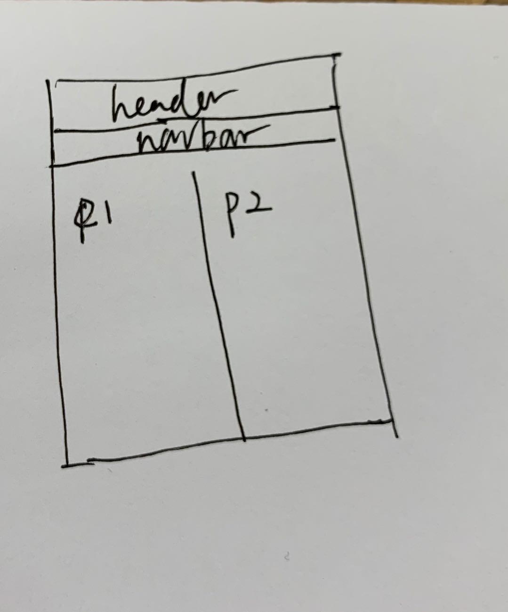
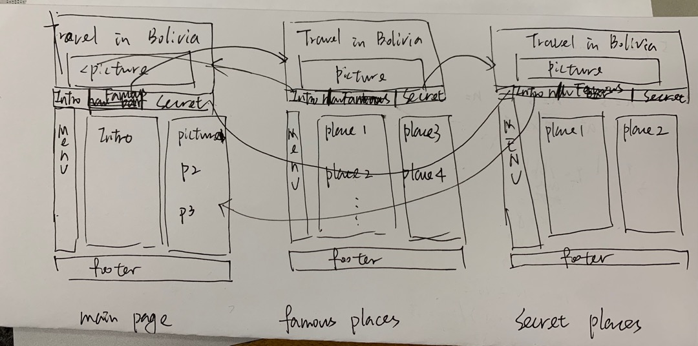
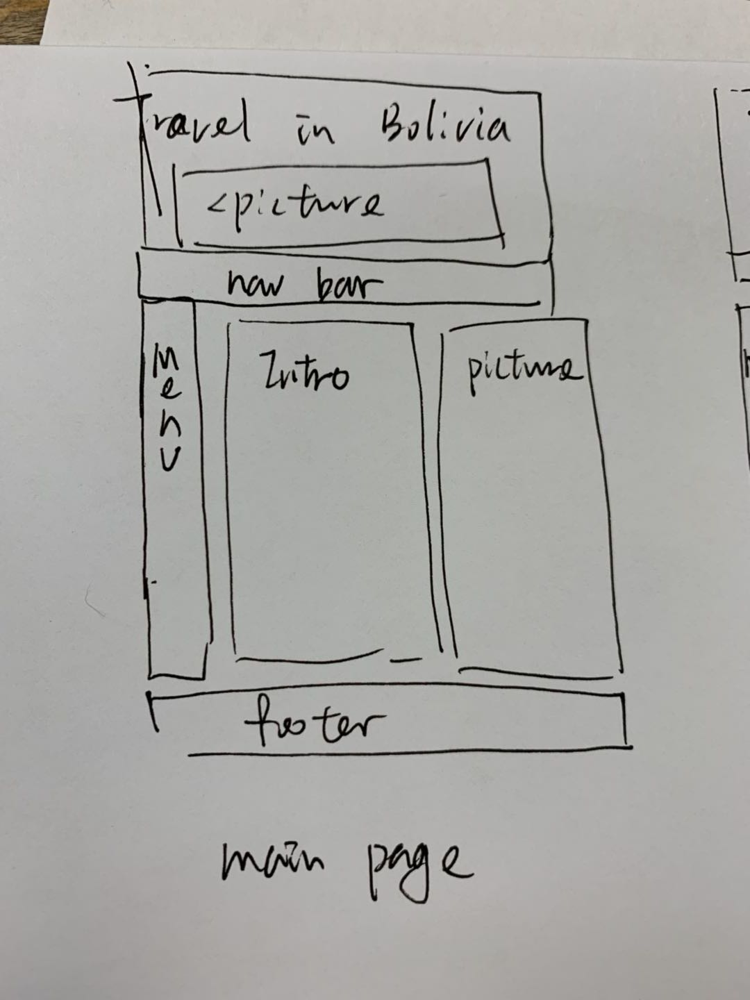
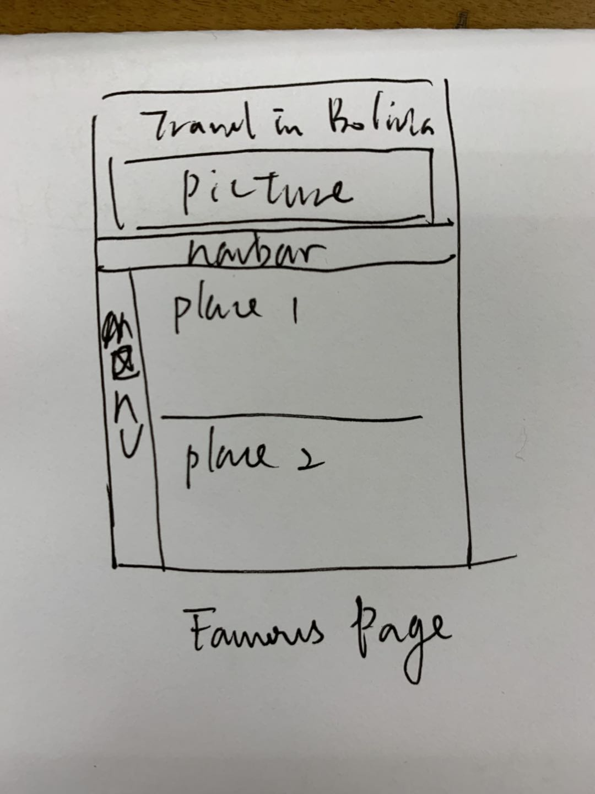
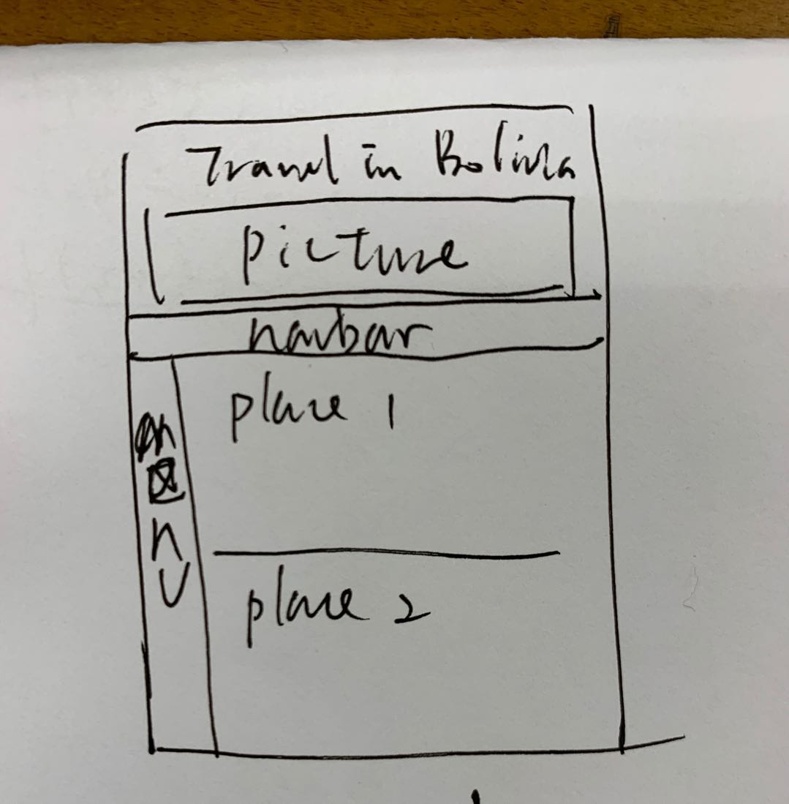
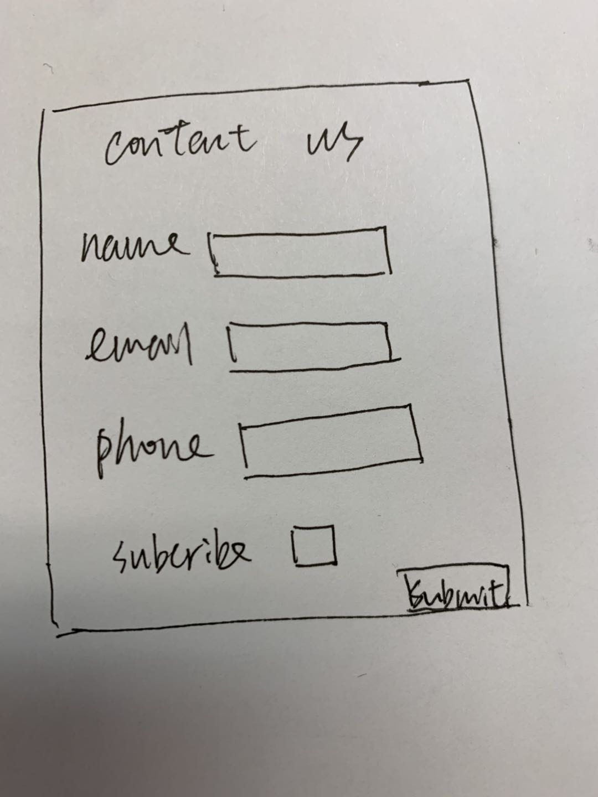

# Project 1: Design Journey

Your Name: Mengfei

**All images must be visible in Markdown Preview. No credit will be provided for images in your repository that are not properly linked in Markdown. Assume all file paths are case sensitive!**

## Markdown (DELETE ME)

[**Delete this markdown instructions section before you submit your final assignment.**]

This is a Markdown file. All written documents that you will submit this semester will be Markdown files. Markdown is a commonly used format by developers and bloggers. It's something that you should know.

The following links are Markdown references:
* <https://guides.github.com/features/mastering-markdown/>
* <https://github.com/adam-p/markdown-here/wiki/Markdown-Cheatsheet>

When writing your Markdown file in VS Code. Open the command palette and search for **Markdown: Open Preview**. This will open up a panel in Code where you can preview your formatted Markdown file.

This is how your insert images into your Markdown documents:
## 

[**Delete this markdown instructions section before you submit your final assignment.**]

# Project 1, Milestone 1 - Design & Plan

## Website Topic

The website is to promote beautiful places in Bolivia to tell travellers how to travel in Bolivia.

## Target Audiences

For people planning their first trip in Bolivia and for people who have been there and planning to go there to find some secret places.

## Design Process

[Document your design process. Show us your sketches. Show us your card sorting. Show us the evolution of your design from your first idea (sketch) to design you wish to implement (sketch). Show us the process you used to organize content and plan the navigation (card sorting).]
    My first idea is to show how beautiful of the Uyuni(A famous palce in Bolivia).
    Then I come to know that it's a little difficult to generate 4 pages with this topic.
    So why not promote Bolivia instead. Following is the basic design for each page.

[Source: (original work) Mengfei]

[Thoroughly document this process. The _process_ is the important part of this assignment, not the final result.]

## Final Design Plan

[Include sketches of your final design here. Don't forget to design the form and its confirmation page!]

[Include your site navigation here. Describe the content on each page. Tip: use bulleted lists.]

###  Final Design sketche
[Source: (original work) Mengfei]

    The website will include 3 information web pages(Introduction, famous palces and secret places) to provide information for travelling in Boliva.  And one more page for collecting the contact information of people.
    All the information pages will include :
        1.The same navbar and if it is the current page, it will be indicated in the navbar.
        2.The same footer which indicate the author and contact information.
        3.Two columns one for introduction in words, the other for related pictures.
        4.A specific menu(content) for each page to navigation.

### Main Page
[Source: (original work) Mengfei]

    This page is to give some basic introduction about Bolivia.
    This page will include:
        1. Title: Home--Travel in Bolivia
        2. A picture in the header
        3. Navbar
        4. Menu:
            1. Basic Intro
            2. Geography
            3. Transportation
        5. The left column: Description of Bolivia (Basic Intro, Geography, Transportation)
        6. The right column: two pictures(link) of famous places and two pictures(link) of secret places

###  Famous Place
[Source: (original work) Mengfei]

    This page is to introduce two famous places in Bolivia(description and pictures).
    This page will include:
        1. Title: Famous Places-Travel in Bolivia
        2. A picture in the header
        3. Navbar
        4. Menu:
            1. Place1.1
            2. Place1.2
        5. Column :
            1. description and pictures.
            2. Contact information form

### Secret Place
[Source: (original work) Mengfei]

    This page is to introduce two secret places in Bolivia(description and pictures).
    This page will include:
        1. Title: Secret Places-Travel in Bolivia
        2. A picture in the header
        3. Navbar
        4. Menu:
            1. Place2.1
            2. Place2.2
        5. Column :
            1. description and pictures.
            2. Contact information form

### Sticky Form
I'm not realy sure what could the form do. at this moment I'm planning to design a separate web page to collect some contact information of the consumers. If the people feel interest in those topic could fill the form to get more information and useful travel links.

The page may look like the sketch below:

[Source: (original work) Mengfei]

## Target Audiences' Needs
The main page include the introduction of Bolivia.
For those who haven't been to Bolivia before, they could visit the main page to know basic information about the country as well as visit those famous places to go. For those have been to there before, most of them have been to those famous places. So I design a secret place website page for them. They could visit the main page to look at the beatiful photograph and visit the secret place page to know more about travel places in Bolivia. Then they could plan their next trip.

## Templates

I plan to use the templates of header, footer, navbar design in my website.

# Project 1, Milestone 2 - Draft Website

## Sticky Form

[What fields are required for your form?]

[Plan out your error messages for your target audiences here.]
The form includes:
    1. name: should not be empty string; error message: please provide your name
    2. email adress: should include @ or it will be a invalid email address; error message: please provide a valid email
    3. phone: should include 10 numbers; error message: please provide a valid mobile number
    4. comment: no error message(the audiences can choose to write it or not)

## Validation Code Plan

[Write out your pseudocode plan for handling the validation of the form.]
set a variable for each row, put the input value to the corresponding variable.
    1. If the form is not submitted, then it will show the form page (including name, email, phone, comments part).
    1. If the form is submitted (clicked the submit button):
        1). check if all the four input is valid, if any one is invalid, show its error message
        2). If all the parts are valid, show confirm page (including the input information).

# Final Submission: Complete & Polished Website

## Target Audiences

[Tell us how your final site meets the needs of the target audiences. Be specific here. Tell us how you tailored your design, content, etc. to make your website usable by both target audiences.]

My target audiences are people who planning to travel in Bolivia.
For those who have not been to Bolivia before, they may want to get a basic knowledge of Bolivia and want to know several palces to plan their visit, they could meet their needs by:
    1. the home page (including basic information about the geography, transportation of the country and some attractive pictures in different places of Bolivia by clicking which they could jump to the introduction of that specific place directly).
    2. the famous page (including two famous travel places in Bolivia, La Paz and Uyuni). These places are famous and easy to get to, very friendly for travellers to spend his/her first time in that country. La Paz is the capital of Bolivia , a very large city, the night sightseeing there is beautiful. Uyuni if famous for the salt flat, mostly all the travellers in Bolivia may visit there.

For those who have been to Bolivia before, they have known how the famous places is in Bolivia. they can plan their next visit by looking through the secret page to know about those places people rarely get to. In that page, I picked two places with peaceful beauty. It's a little more difficult to get to and with less visitors but it's worth to visit if you are interested in inca culture or the jungles.

## Reflection

[Take this time to reflect on what you learned during this assignment. How have you improved from 1300? What things did you have trouble with?]
I learnt to create a whole website by myself (I haven't write any web code before and it's great to complete this assignment anyway). I learnt how to design a website (think about meeting the needs of audiences, draw sketches before coding and basic html css and php code).
Actually I didn't take 1300 before, from the website of 1300 it seems that the course is mainly about static web design with html and css. I think in 2300 I learn about how to interact with audience using the sticky form.
At first I'm trouble with css design(maybe still trouble with a little bit) but with the help of TA and some toturial website, I finished milestone1 and it became much easier after m1.
Finally, This is a interesting couse and it's great to choose the topic freely.
