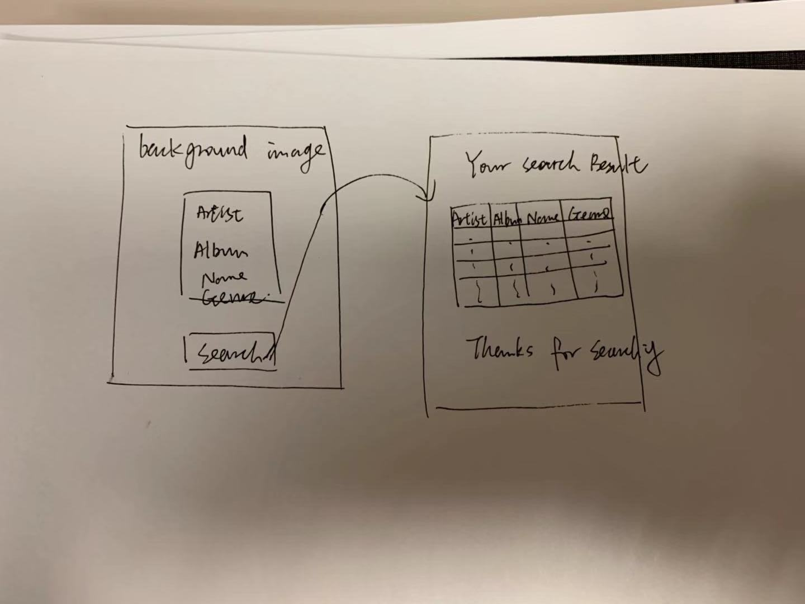
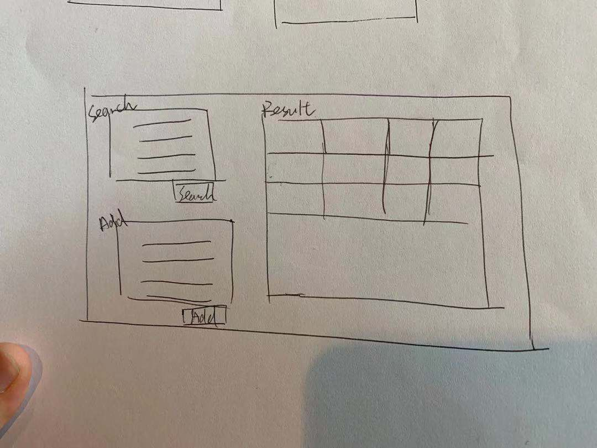

# Project 2: Design Journey

Your Name: Mengfei Xiong

**All images must be visible in Markdown Preview. No credit will be provided for images in your repository that are not properly linked in Markdown. Assume all file paths are case sensitive!**

# Project 2, Milestone 1 - Design, Plan, & Draft Website

## Describe your Catalog

[What will your collection be about? What types of attributes will you keep track of for the *things* in your collection? 1-2 sentences.]
My collection is about songs, keep track the name, artists, album and genre


## Target Audiences

[Tell us about your target audience(s).]
People interested in listening to music and want to get the information of a specific singer/song/genre of music/album. Also the insert form allow them to add records that haven't been invluded in the database.

## Design Process

[Document your design process. Show us the evolution of your design from your first idea (sketch) to design you wish to implement (sketch). Show us the process you used to organize content and plan the navigation (card sorting).]

[Label all images. All labels must be visible in Markdown Preview.]
Version 1.

Firstly, I was planning to generate a website with two pages, one for input forms and the other to show the result. But when I want to judge if the search is valid it becomes so difficult. What I known is that I can only get the input of the form after the audience press the submit button and if I want to use two pages I should directly jump to the other page right after the valid submit. For the invalide submit(no input search column), the page should stay at the form page. But for html part, It is not good to use variable in form 'action' because it could only get the previous state of the variable. I was stuck at this part. Then I want to design the website with only one page, just like the lab. (If you could help me with the two-page design, please let me know!)

Version 2.

Then I realized that it is much easy to design a one-page website. I think it is good to palce the forms in the left and print the result in the right. It would show the full database when there is no serach input and it will only print the search result after the audience input some search constraints.

## Final Design Plan

[Include sketches of your final design here.]
[Source: (original work) Mengfei]

I generated a one-page website for this project.
Home page include two forms enable people to search and insert records.

The upper left part is the search form, it includes four different columns, and people should input at least one attribute to make the search valid. The result will only show the records that wildcard match all of the valid input attributes (1-4 attributes).

The lower left part is the insert form, it also includes four different columns for people to insert new song record. Since the name and the author of the song are required, so people should at least input those two attributes to make the insertion valid. If the insertion is success there is a message on the top of the page will show "Insert Success!", and if the submitted insert form with no input in either artist or name column it will show "You must insert both the name and the artist!".

The result table is on the right part. By default it shows all the records of the database. If there is a valid search, it will show the records that satisfy the search constriants. If there is a valid insert, it will show the all the records (includes the new records).

## Templates

[Identify the templates you will use on your site.]

I will use the footer as a template.

## Database Schema Design

[Describe the structure of your database. You may use words or a picture. A bulleted list is probably the simplest way to do this. Make sure you include constraints for each field.]

Table: music
* id: the primary key of the records. According to the instruction it is integer. PK, U, Not, AI.
* sname: the name of this song , the type is 'text'. it should not be null because the database is about the collection of songs so the name of the song should not be null.(different songs could have the same name, so it is not unique).  Not
* aritist: the person who made this song, the type is 'text'. Each song should have a author, so it should not be null. Not.
* album: the album of this song, it is optional, there are some songs is not include in any album. No constraint.
* genre: the genre of this song, it is optional. No constraint.

## Database Query Plan

[Plan your database queries. You may use natural language, pseudocode, or SQL.]

1. All records
```sql
select * from music;
```


2. Search records
```sql
SELECT * FROM music WHERE (sname LIKE '%xxx%');
SELECT * FROM music WHERE (aritist LIKE '%xxx%');
SELECT * FROM music WHERE (album LIKE '%xxx%');
SELECT * FROM music WHERE (genre LIKE '%xxx%');
```
In the insert form I use the following sql to search the records.

```sql
SELECT * FROM music WHERE (sname LIKE '%xxx%' AND artist LIKE '%xxx%'  AND album LIKE '%xxx%' AND genre LIKE '%genre%');
```


3. Insert record
```sql
INSERT INTO music (sname, artist, album, genre) VALUES ('xxxx', 'xxxx', 'xxxx','xxxx');
```

## Code Planning

[Plan any PHP code you'll need here.]
two functions in init.php to retrieve data.
judge if the submit form is valid or not
print function to print data on the result page.
Two different user defined functions to print the result table and the messages.


# Final Submission: Complete & Polished Website

## Reflection

[Take this time to reflect on what you learned during this assignment. How have you improved since Project 1? What things did you have trouble with?]
I learnt to connect the website with database and use sql to search and insert records.
In Project 1, I struggled with css issues since I didn't take web course before. In Project 2 I much more familiar with html and css. I troubled with wildcard search before lab 6.
