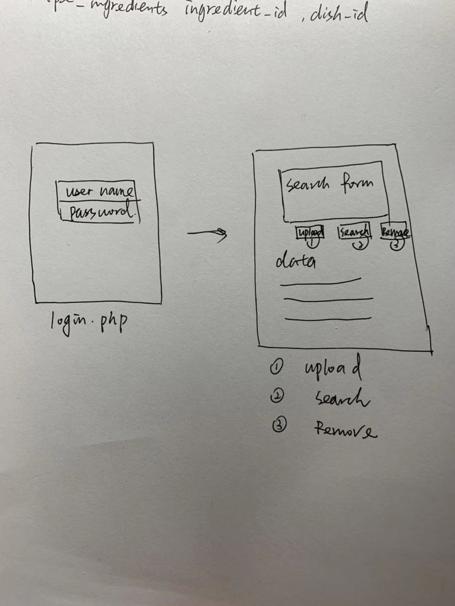
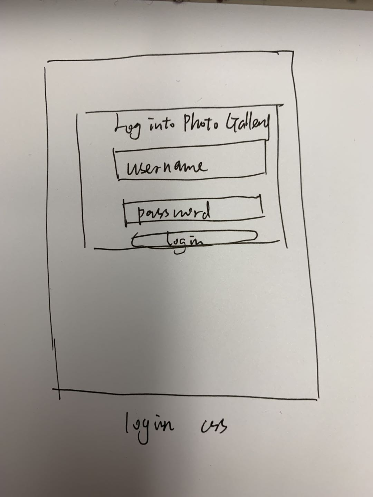
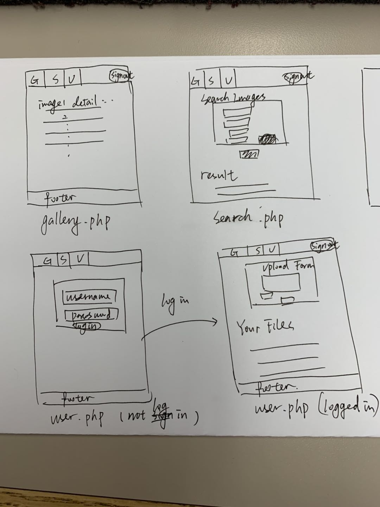
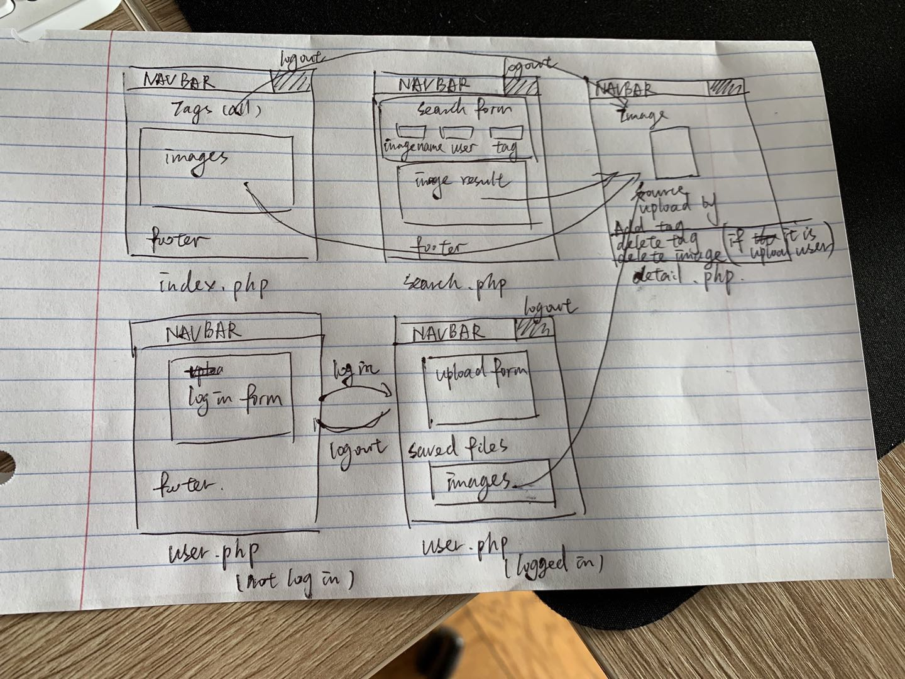

# Project 3: Design Journey

Your Name: Mengfei Xiong

**All images must be visible in Markdown Preview. No credit will be provided for images in your repository that are not properly linked in Markdown. Assume all file paths are case sensitive!**


# Project 3, Milestone 1 - Design, Plan, & Draft Website

## Describe your Gallery

[What will your gallery be about? 1 sentence.]
It is a collection of screen wallpaper (upload and download as you want).

## Target Audiences

[Tell us about your target two audiences. ~1-3 sentences per audience]
1. Photographer, they want to share their own beautiful screen wallpaper, they can upload their photography or their collection of wallpaper.
2. People want to get some beautiful screen wallpaper, they can download the images that they like.

## Design Process

[Document your design process. Show us the evolution of your design from your first idea (sketch) to design you wish to implement (sketch). Show us the process you used to organize content and plan the navigation (e.g. card sorting).]

[Label all images. All labels must be visible in Markdown Preview.]
#### Version 1.

The website may inclue login, search, upload, remove part. I think maybe I could use two php pages. One is login.php for people to login in to the website; the other is data.php for people to search, upload or remove the images. Then I designed the login page

But then I realized it may become kind of mess for a form with four buttons. The form seems not beautiful. And there is a better way to do it inspired by lab8 and the demo in the lecture. What I want to implement is a wallpaper gallery and everyone could use the website to search and look the collection of images. However only those who logged in as members could upload their works. So I changed my plan to three pages design. Gallery page as a main page to show all the images in the database. Search page to let peopel search for the wallpaper by author, image_name and tags. Only User page need audiences to log in before uploading their images. And after the audiences logged in, the website may remember them for 1 hour and show a log_out button on the right side of the navbar.

#### Version 2.

1. index.php:
* not required to login
* main page show all
fin the images in the gallery
* each record includes the image's preview, link to the original image, description, tags, description and the upload user's name

2. search.php:
* not required to login
* search page, using wildcard seraching to allow all the audiences search for their favorite images by inputing image_name, upload user's name, tags
* show the result below the search form
   if there is no search input: show the all the image records
   if there is no matched record: show message "no match"

3. user.php:
* required to login
* upload and remove page
* allow the logged in users to upload their works
  if the user is not logged in: show login form
  else: show upload form
* allow logged in users to view their uploaded records then decided to remove any of them

Then, during the process, I think it's much easier to put the delete function in the detail.php, instead of user.php. Because if it is in the user.php, when the user decided to delete a image, I have to judge which image is the user chose. And if it is in the detail.php, I only have to judge is it the upload user choose to delete.
#### Version 3.

1. index.php:
* not required to login
* main page show all the tag records and image records in the gallery
* each image record includes the image's preview, link to the detail.php includes image, description, tags, description and the upload user's name
* each tag record links to the detail.php includes all the images of with this tag

2. search.php:
* not required to login
* search page, using wildcard seraching to allow all the audiences search for their favorite images by inputing image name, upload user's name, tags
* show the result below the search form
   if there is no search input: show the all the image records
   if there is no matched record: show message "no match"
* all the image records link to coresponding detail.php

3. user.php:
* required to log in
* allow the logged in users to upload their works
  if the user is not logged in: show login form
  else: show upload form
* allow logged in users to view their uploaded records

4. detail.php:
* not required to login
* for image record, show the image name, upload user, tags, and add_tag form; if it is the upload user, this user could also delete tags or delete this image in this page
* for tag record, show all the images with this tag.


## Final Design Plan

[Include sketches of your final design here.]

1. index.php:
* not required to login
* main page show all the tag records and image records in the gallery
* each image record includes the image's preview, link to the detail.php includes image, description, tags, description and the upload user's name
* each tag record links to the detail.php includes all the images of with this tag

2. search.php:
* not required to login
* search page, using wildcard seraching to allow all the audiences search for their favorite images by inputing image name, upload user's name, tags
* show the result below the search form
   if there is no search input: show the all the image records
   if there is no matched record: show message "no match"
* all the image records link to coresponding detail.php

3. user.php:
* required to log in
* allow the logged in users to upload their works
  if the user is not logged in: show login form
  else: show upload form
* allow logged in users to view their uploaded records

4. detail.php:
* not required to login
* for image record, show the image name, upload user, tags, and add_tag form; if it is the upload user, this user could also delete tags or delete this image in this page
* for tag record, show all the images with this tag.

## Templates

[Identify the templates you will use on your site.]
The header and the footer.
And init.php

## Database Schema Design

[Describe the structure of your database. You may use words or a picture. A bulleted list is probably the simplest way to do this. Make sure you include constraints for each field.]

[Hint: You probably need `users`, `images`, `tags`, and `image_tags` tables.]

[Hint: For foreign keys, use the singular name of the table + _id. For example: 1) `user_id` in the `images` table or 2) `image_id` and `tag_id` for the `image_tags` table.]

```
users(
id: INTEGER {PK, U, Not, AI} -- surrogate primary key
user_name: TEXT {U, Not}
user_password: TEXT {U, Not}
)
```
```
images(
id: INTEGER {PK, U, Not, AI} -- surrogate primary key
name: TEXT {Not}
descrption: TEXT --No constraint
upload_user_id: TEXT {Not}
)
```
```
tags(
id: INTEGER {PK, U, Not, AI} -- surrogate primary key
name: TEXT {U, Not}
)
```
```
image_tags(
id: INTEGER {PK, U, Not, AI} -- surrogate primary key
image_id: INTERGER {Not}
tag_id: INTERGER {Not}
)
```

## Code Planning

[Plan what top level PHP pages you'll need.]
Top level page is the login.php, showing a form for people to login. If people don't login they cannot upload or remove any images, they can only search for images.

[Plan what templates you'll need.]
* header.php : show the title of the website
* footer.php : show the contact information
* init.php: database functions and login, logout functions

[Plan any PHP code you'll need.]

Example:
```
function is_user_logged_in() {
  if user is logged in, return true
  otherwise, return false
}

// Show logout, only if user is logged in.
if user is logged in (is_user_logged_in()) then
  show logout link
end
```
```
function search_image{
  form include image_name, tags
  if(isset(submit)){
    if(at least one row is not null){
      sql search statement
      if(result){
          show the result
      }
      else{
        show (there is no that kind of iamge in the collection)
      }
    }
    else{
      show error message
    }
  }
}
```
```
  if(choose upload){
    form include image file, tags, image_name, image_description
    if(isset(submit)){
      if(all the required part is filled){
        show success message
        connect this image_id to the user
      }
      else{
        show error message
      }
    }
  }

  if(choose search){
    search_image()
  }

  if(choose remove){
    search_image()
    if(the image is belong to that user){
      sql remove statement
      show success message
    }
    else{
      show error message
    }
}
``` -->

## Database Query Plan

[Plan your database queries. You may use natural language, pseudocode, or SQL.]
* search:
```sql
SELECT * FROM images LEFT OUTER JOIN image_tags ON images.id = image_tags.image_id LEFT OUTER JOIN tags ON image_tags.tag_id = tags.id WHERE (image.image_name LIKE '%xxx%' AND tag.name LIKE '%xxx%');
```
* upload:
```sql
INSERT INTO images (name, description) VALUES ('name', 'description');
INSERT INTO tags (name) VALUES ('tag');
INSERT INTO image_tags (image_id,tag_id) VALUES ()
```
* delete
```sql
DELETE tag_id = 5 for image_id = 4 in image_tags table
```
# Project 3, Milestone 2 - Gallery and User Access Controls

## Issues & Challenges

[Tell us about any issues or challenges you faced while trying to complete milestone 2. 2-4 sentences/bullet points]
1. I tried to show the image records on Gallery.php and I want to show the preview of the image in the upload directory. But I don't know how could I get the uploaded_image_id. (not solved yet)
2. Overall design, I confused about how to design the whole website to make it seems logical and I didn't know how to set cookies. Thanks to Lab8.
3. Typo in programming, It difficult to debug when there is only a typo that ruined the function.


# Final Submission: Complete & Polished Website

## Reflection

[Take this time to reflect on what you learned during this assignment. How have you improved since starting this class? 2-4 sentences]
I don't have any experience in web design before this class. The css and html is not easy for me at the beginning, but now I think I get some basic strategies. And it's interesting to design then coding a whole website.
